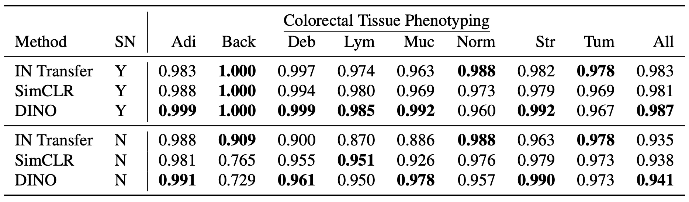
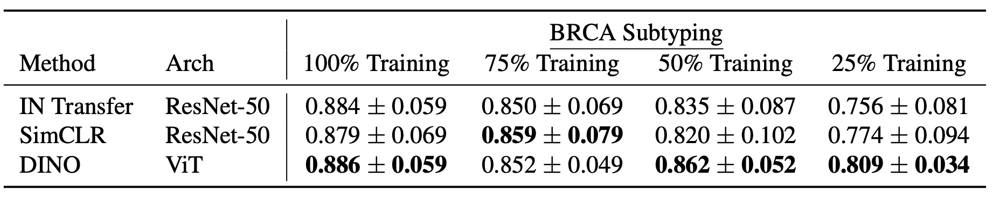
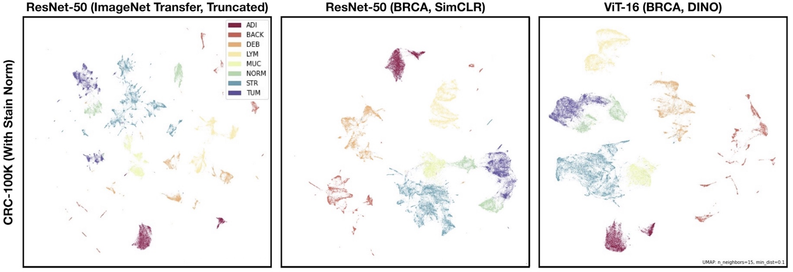
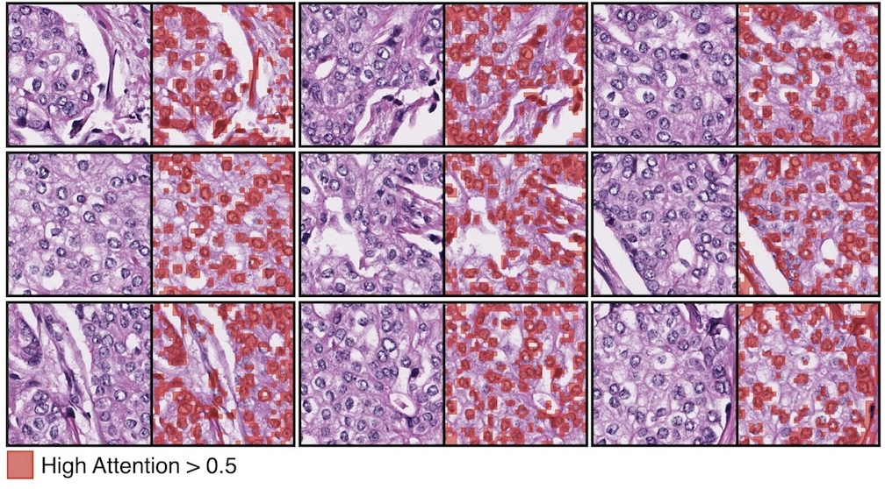

Self-Supervised Vision Transformers Learn Visual Concepts in Histopathology
===========
<details>
<summary>
  <b>Self-Supervised Vision Transformers Learn Visual Concepts in Histopathology</b>, LMRL Workshop, NeurIPS 2021.
  <a href="https://www.lmrl.org" target="blank">[Workshop]</a>
  <a href="https://arxiv.org/abs/2203.00585" target="blank">[arXiv]</a>
  <br><em>Richard. J. Chen, Rahul G. Krishnan</em></br>
</summary>

```bash
@article{chen2022self,
  title={Self-Supervised Vision Transformers Learn Visual Concepts in Histopathology},
  author={Chen, Richard J and Krishnan, Rahul G},
  journal={Learning Meaningful Representations of Life, NeurIPS 2021},
  year={2021}
}
```
</details>

<div align="center">
  
</div>

**Summary / Main Findings:**
1. In head-to-head comparison of SimCLR versus DINO, DINO learns more effective pretrained representations for histopathology - likely due to 1) not needing negative samples (histopathology has lots of potential class imbalance, 2) capturing better inductive biases about the part-whole hierarchies of how cells are spatially organized in tissue.
2. ImageNet features do lag behind SSL methods (in terms of data-efficiency), but are better than you think on patch/slide-level tasks. I have been using the ImageNet features (from a truncated ResNet-50 after 3rd residual block), and has given me very decent performance in our [CLAM package](https://github.com/mahmoodlab/CLAM).
3. SSL helps out a lot with stain normalization. With vanilla data augmentations, global structure of morphological subtypes are more well-preserved than ImageNet features.
4. Self-supervised ViTs are able to localize cell location quite well w/o any supervision. Our results show that ViTs are able to localize visual concepts in histopathology in introspecting the attention heads.

## Updates
Stay tuned for more updates :).
- [ ] TBA: Pretrained SimCLR and DINO models on TCGA-Lung (Larger working paper, in submission).
- [ ] TBA: Pretrained SimCLR and DINO models on TCGA-PanCancer (Larger working paper, in submission).
- [ ] TBA: PEP8-compliance (cleaning and organizing code).
- [x] 03/04/2022: Reproducible and largely-working codebase that I'm satisfied with and have heavily tested.

## Pre-Reqs
We use [Git LFS](https://git-lfs.github.com) to version-control large files in this repository (e.g. - images, embeddings, checkpoints). After installing, to pull these large files, please run:
```bash
git lfs pull
```

## Pretrained Models
SIMCLR and DINO models were trained for 100 epochs using their vanilla training recipes in their respective papers. These models were developed on 2,055,742 patches (```256 x 256``` resolution at ```20X``` magnification) extracted from diagnostic slides in the TCGA-BRCA dataset, and evaluated via K-NN on patch-level datasets in histopathology.
<table>
  <tr>
    <th>Arch</th>
    <th>SSL Method</th>
    <th>Dataset</th>
    <th>Epochs</th>
    <th>Dim</th>
    <th>K-NN</th>
    <th>Download</th>
  </tr>
  
  <tr>
    <td>ResNet-50</td>
    <td>Transfer</td>
    <td>ImageNet</td>
    <td>N/A</td>
    <td>1024</td>
    <td>0.935</td>
    <td>N/A</td>
  </tr>
  
  <tr>
    <td>ResNet-50</td>
    <td><a href="https://github.com/google-research/simclr">SimCLR</a></td>
    <td>TCGA-BRCA</td>
    <td>100</td>
    <td>2048</td>
    <td>0.938</td>
    <td><a href="https://github.com/Richarizardd/Self-Supervised-ViT-Path/blob/master/ckpts/resnet50_tcga_brca_simclr.pt">Backbone</a></td>
  </tr>
  
  <tr>
    <td>ViT-S/16</td>
    <td><a href="https://github.com/facebookresearch/dino">DINO</a></td>
    <td>TCGA-BRCA</td>
    <td>100</td>
    <td>384</td>
    <td>0.941</td>
    <td><a href="https://github.com/Richarizardd/Self-Supervised-ViT-Path/blob/master/ckpts/vits_tcga_brca_dino.pt">Backbone</a></td>
  </tr>
</table>

### Data Download + Data Preprocessing
- CRC-100K: Train and test data can be downloaded as is via this [Zenodo link](https://zenodo.org/record/1214456).
- BreastPathQ: Train and test data can be downloaded from the [official Grand Challenge link](https://breastpathq.grand-challenge.org).
- TCGA-BRCA: To download diagnostic WSIs (formatted as .svs files) and associated clinical metadata, please refer to the [NIH Genomic Data Commons Data Portal](https://portal.gdc.cancer.gov/) and the [cBioPortal](https://www.cbioportal.org/). WSIs for each cancer type can be downloaded using the [GDC Data Transfer Tool](https://docs.gdc.cancer.gov/Data_Transfer_Tool/Users_Guide/Data_Download_and_Upload/).

For CRC-100K and BreastPathQ, pre-extracted embeddings are already available and processed in [./embeddings_patch_library](https://github.com/Richarizardd/Self-Supervised-ViT-Path/tree/master/embeddings_patch_library). See [patch_extraction_utils.py](https://github.com/Richarizardd/Self-Supervised-ViT-Path/blob/master/patch_extraction_utils.py) on how these patch datasets were processed.

**Additional Datasets + Custom Implementation**:
This codebase is flexible for feature extraction on a variety of different patch datasets. To extend this work, simply modify [patch_extraction_utils.py](https://github.com/Richarizardd/Self-Supervised-ViT-Path/blob/master/patch_extraction_utils.py) with a custom Dataset Loader for your dataset. As an example, we include BCSS (results not yet updated in this work).
- BCSS (v1): You can download the BCSS dataset from the [official Grand Challenge link](https://bcsegmentation.grand-challenge.org). For this dataset, we manually developed the train and test dataset splits and labels using majority-voting. Reproducibility for the raw BCSS dataset may be not exact, but we include the pre-extracted embeddings of this dataset in [./embeddings_patch_library](https://github.com/Richarizardd/Self-Supervised-ViT-Path/tree/master/embeddings_patch_library) (denoted as version 1).

## Evaluation: Patch-Level Classification on CRC-100K + BreastPathQ
Run the notebook [patch_extraction.ipynb](https://github.com/Richarizardd/Self-Supervised-ViT-Path/blob/master/patch_extraction.ipynb), followed by [patch_evaluation.ipynb](https://github.com/Richarizardd/Self-Supervised-ViT-Path/blob/master/patch_evaluation.ipynb). The evaluation notebook should run "out-of-the-box" with Git LFS.

<div align="center">
  
</div>

## Evaluation: Slide-Level Classification on TCGA-BRCA (IDC versus ILC)
Install the [CLAM Package](https://github.com/mahmoodlab/CLAM), followed by using the [10-fold cross-validation splits](https://github.com/Richarizardd/Self-Supervised-ViT-Path/tree/master/slide_evaluation/splits/10foldcv_subtype/tcga_brca) made available in ```./slide_evaluation/10foldcv_subtype/tcga_brca```. Tensorboard train + validation logs can visualized via:

```bash
tensorboard --logdir ./slide_evaluation/results/
```

<div align="center">
  
</div>

## Visualization: Creating UMAPs
Install [umap-learn](https://umap-learn.readthedocs.io/en/latest/) (can be tricky to install if you have incompatible dependencies), followed by using the following code snippet in [patch_extraction_utils.py](https://github.com/Richarizardd/Self-Supervised-ViT-Path/blob/aab950a98118f45536a44ee599720ba4ae691524/patch_extraction_utils.py#L111), and is used in [patch_extraction.ipynb](https://github.com/Richarizardd/Self-Supervised-ViT-Path/blob/master/patch_extraction.ipynb) to create **Figure 4**.


<div align="center">
  
</div>

## Visualization: Attention Maps
Attention visualizations (reproducing **Figure 3**) can be performed via walking through the following notebook at [attention_visualization_256.ipynb](https://github.com/Richarizardd/Self-Supervised-ViT-Path/blob/master/attention_visualization_256.ipynb).

<div align="center">
  
</div>

## Issues
- Please open new threads or report issues directly (for urgent blockers) to richardchen@g.harvard.edu.
- Immediate response to minor issues may not be available.

## Acknowledgements, License & Usage 
- Part of this work was performed while at Microsoft Research. We thank the BioML group at Microsoft Research New England for their insightful feedback.
- This work is still under submission in a formal proceeding. Still, if you found  our work useful in your research, please consider citing our paper at:
```bash
@article{chen2022self,
  title={Self-Supervised Vision Transformers Learn Visual Concepts in Histopathology},
  author={Chen, Richard J and Krishnan, Rahul G},
  journal={Learning Meaningful Representations of Life, NeurIPS 2021},
  year={2021}
}
```
© This code is made available under the GPLv3 License and is available for non-commercial academic purposes.
