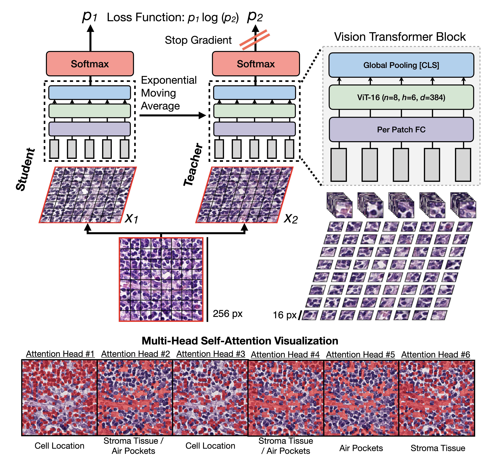

Self-Supervised Vision Transformers Learn Visual Concepts in Histopathology
===========
<details>
<summary>
  <b>Self-Supervised Vision Transformers Learn Visual Concepts in Histopathology</b>, LMRL Workshop, NeurIPS 2021.
  <a href="https://arxiv.org/abs/2203.00585" target="blank">[PDF]</a>
  <br><em>Richard. J. Chen, Rahul G. Krishnan</em></br>
</summary>

```bash
@article{chen2022self,
  title={Self-Supervised Vision Transformers Learn Visual Concepts in Histopathology},
  author={Chen, Richard J and Krishnan, Rahul G},
  journal={Learning Meaningful Representations of Life, NeurIPS 2021},
  year={2021}
}
```
</details>

<div align="center">
  
</div>

## Pretrained Models
SIMCLR and DINO models were trained for 100 epochs using their vanilla training recipes in their respective papers. These models were trained on 2,055,742 patches (```256 x 256``` resolution at ```20X``` magnification) extracted from diagnostic slides in the TCGA-BRCA dataset.
<table>
  <tr>
    <th>Arch</th>
    <th>SSL Method</th>
    <th>Epochs</th>
    <th>Dim</th>
    <th>CRC100K-R</th>
    <th>CRC100K-N</th>
    <th>Download</th>
  </tr>
  
  <tr>
    <td>ResNet-50 (Trunc)</td>
    <td>ImageNet Transfer</td>
    <td>N/A</td>
    <td>1024</td>
    <td>0.935</td>
    <td>0.983</td>
    <td>N/A</td>
  </tr>
  
  <tr>
    <td>ResNet-50</td>
    <td><a href="https://github.com/PyTorchLightning/lightning-bolts/blob/master/pl_bolts/models/self_supervised/simclr/simclr_module.py">SimCLR</a></td>
    <td>100</td>
    <td>2048</td>
    <td>0.938</td>
    <td>0.981</td>
    <td><a href="https://github.com/Richarizardd/Self-Supervised-ViT-Path/blob/master/ckpts/resnet50_tcga_brca_simclr.pt">Backbone</a></td>
  </tr>
  
  <tr>
    <td>ViT-S/16</td>
    <td><a href="https://github.com/facebookresearch/dino">DINO</a></td>
    <td>100</td>
    <td>384</td>
    <td>0.941</td>
    <td>0.987</td>
    <td><a href="https://github.com/Richarizardd/Self-Supervised-ViT-Path/blob/master/ckpts/vits_tcga_brca_dino.pt">Backbone</a></td>
  </tr>
</table>

### Data Download + Data Preprocessing
- CRC-100K: Train and test data can be downloaded as is via this [Zenodo link](https://zenodo.org/record/1214456).
- BreastPathQ: Train and test data can be downloaded from the [official Grand Challenge link](https://breastpathq.grand-challenge.org).
- TCGA-BRCA: To download diagnostic WSIs (formatted as .svs files) and associated clinical metadata, please refer to the [NIH Genomic Data Commons Data Portal](https://portal.gdc.cancer.gov/) and the [cBioPortal](https://www.cbioportal.org/). WSIs for each cancer type can be downloaded using the [GDC Data Transfer Tool](https://docs.gdc.cancer.gov/Data_Transfer_Tool/Users_Guide/Data_Download_and_Upload/).

For CRC-100K and BreastPathQ, pre-extracted embeddings are already available and processed in [./embeddings_patch_library](https://github.com/Richarizardd/Self-Supervised-ViT-Path/tree/master/embeddings_patch_library). See [patch_extraction_utils.py](https://github.com/Richarizardd/Self-Supervised-ViT-Path/blob/master/patch_extraction_utils.py) on how these patch datasets were processed.

## Evaluation: Patch-Level Classification on CRC-100K + BreastPathQ
Run the notebook [patch_extraction.ipynb](https://github.com/Richarizardd/Self-Supervised-ViT-Path/blob/master/patch_extraction.ipynb), followed by [patch_evaluation.ipynb](https://github.com/Richarizardd/Self-Supervised-ViT-Path/blob/master/patch_evaluation.ipynb).

## Evaluation: Slide-Level Classification on TCGA-BRCA (IDC versus ILC)
Install the [CLAM Package](https://github.com/mahmoodlab/CLAM), followed by using the [10-fold cross-validation splits](https://github.com/Richarizardd/Self-Supervised-ViT-Path/tree/master/slide_evaluation/splits/10foldcv_subtype/tcga_brca) made available in ```./slide_evaluation/10foldcv_subtype/tcga_brca```. Tensorboard train + validation logs can visualized via:

```bash
tensorboard --logdir ./slide_evaluation/results/
```

## Visualization: Creating UMAPs
Install [umap-learn](https://umap-learn.readthedocs.io/en/latest/) (can be tricky to install if you have incompatible dependencies), followed by using the following code snippet in [patch_extraction_utils.py](https://github.com/Richarizardd/Self-Supervised-ViT-Path/blob/aab950a98118f45536a44ee599720ba4ae691524/patch_extraction_utils.py#L111).
